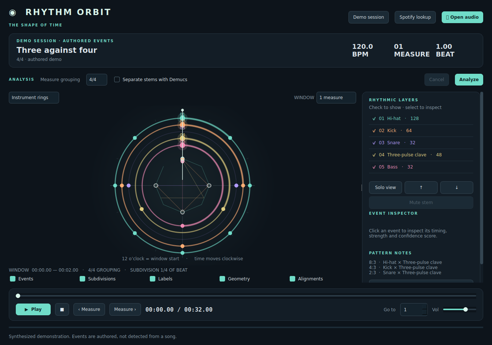

# Rhythm Orbit

A native Python / PySide6 desktop app for exploring the rhythm of recorded music as concentric rings. Event positions and geometry come from onset timestamps. There is no web frontend.



## Run the downloaded ZIP

Extract the ZIP, open PowerShell in the `rhythm-orbit` folder, and run:

```powershell
py -3.12 -m venv .venv
.\.venv\Scripts\python.exe -m pip install -e .
.\.venv\Scripts\python.exe -m rhythm_orbit
```

For macOS/Linux use `python3 -m venv .venv` and `.venv/bin/python` in place of the Windows Python paths. The ZIP includes the full source and tests; Git is not required for this route.

## Run on Windows

Install **Python 3.11 or 3.12** from [python.org](https://www.python.org/downloads/) and Git, then use PowerShell:

```powershell
git clone https://github.com/JordanPenaGit/visualizer.git
cd visualizer
py -3.12 -m venv .venv
.\.venv\Scripts\python.exe -m pip install -e .
.\.venv\Scripts\python.exe -m rhythm_orbit
```

You do not need to activate the virtual environment when using its Python executable directly.

## Run on macOS / Linux

```bash
git clone https://github.com/JordanPenaGit/visualizer.git
cd visualizer
python3 -m venv .venv
.venv/bin/python -m pip install -e .
.venv/bin/python -m rhythm_orbit
```

A graphical desktop and audio output are required for normal use. Qt's Linux platform plugin may need your distribution's XCB/EGL libraries. Qt Multimedia also requires the PulseAudio client library even for headless tests. On Ubuntu/Debian, install the following before launching:

```bash
sudo apt-get update
sudo apt-get install -y libegl1 libopengl0 libxkbcommon0 libdbus-1-3 libpulse0
```

The app also installs the `rhythm-orbit` command inside the virtual environment.

## Use

1. The app starts with **Three against four**, a labeled synthesized demo with matching audio and authored events. Press Play to explore it immediately.
2. **Open audio** loads your own WAV, MP3, FLAC, M4A, OGG, AAC, AIFF or Opus file for playback. Decoder availability depends on the format, OS and FFmpeg. WAV and FLAC are the most portable choices.
3. Choose the measure grouping and optionally **Separate stems with Demucs**, then **Analyze**. Full-mix analysis produces a single **Mix onsets** ring. It does not invent instrument labels from the mix.
4. Use the 1/2/4/8-measure window, measure buttons, measure jump, seek bar, volume, and five visualization modes. Space toggles playback; Ctrl+O opens audio.
5. Check layers to show/hide them. Select a layer to solo its visualization or change its order. Click a marker for timestamp, beat position, grid estimate, timing offset, strength, status and confidence score.
6. Separated tracks support **Mute stem**. Kick/snare/hat candidates share the drums stem, so muting one mutes all drums. Mixes are rendered in the background and played through one synchronized player.
7. Export the structured analysis as JSON. Reopening and analyzing identical audio restores the content-addressed cache.

Each visible ring uses the same time window. Twelve o'clock is the start; time proceeds clockwise. Quarter-note beat ticks follow the estimated beat timestamps. Equal sectors appear only when the attacks in that window are evenly spaced. Inner paths connect events chronologically. White circles mark attacks on different layers within 25 ms. Hidden layers do not contribute to alignment geometry.

## What this version measures

| Capability | Implementation and limits |
| --- | --- |
| Tempo and beats | librosa onset envelope and dynamic-programming beat tracker; global tempo estimate, local beat timestamps. Half/double-tempo mistakes are possible. |
| Meter / downbeats | Conservative accent-based candidate stored in metadata when evidence is strong. The UI uses a **user-selected** 3/4, 4/4, 5/4 or 7/4 grouping. The first tracked beat is an assumed downbeat; a preceding partial interval is labeled Pickup. Grouping is not an automatic time-signature transcription. |
| Onsets | Spectral-flux attacks detected from the mix or each separated stem. These are attacks, not complete pitched-note transcriptions. |
| Instrument layers | Optional Demucs `htdemucs` drums, bass, vocals and other stems. Separation can leak instruments. No automatic guitar/piano labeling of the other stem. |
| Drum labels | Conservative spectral heuristics for kick, snare and hi-hat **candidates**. Ambiguous attacks remain unclassified percussion. Cymbal/tom separation and simultaneous drum transcription are not claimed. |
| Quantization | Nearest quarter, eighth, sixteenth, 32nd, triplet, quintuplet or septuplet grid; original onset time is preserved, with residual in milliseconds. A nearest grid is not proof that the player intended that tuplet. Swing and dotted timing remain in the timestamps. |
| Repetition | Onset phase/count similarity over at least three measures. Varying or nonrepeating material can produce no candidate. |
| Polyrhythm | Possible reduced pulse ratios for two evenly spaced repeating layers spanning the same measures. 4 vs 8 is a straight subdivision, not a polyrhythm. This does not identify polymeter or arbitrary repeating cycle lengths. |
| Confidence | Heuristic scores, **not calibrated probabilities**. Filled markers are detected attacks; hollow markers represent inferred classifications or uncertain results. Demo events are separately labeled. |
| Synchronization | Every frame reads `QMediaPlayer.position()`. There is no accumulating animation clock. Device and codec latency still affect perceived timing. |

Accuracy takes priority over attractive geometry. The default real-audio view can have just one ring. This is an incremental, working desktop release, not a claim of reliable multi-instrument transcription for arbitrary commercial mixes. Future model work includes learned downbeats, compound/changing meter, multi-label percussion transcription, pitched note events and polymeter inference.

## Optional Demucs separation

Install the extra into the **same** virtual environment:

```powershell
.\.venv\Scripts\python.exe -m pip install -e ".[separation]"
```

On macOS/Linux use `.venv/bin/python` instead. Install [FFmpeg](https://ffmpeg.org/download.html) and make `ffmpeg` available on PATH. See the [official Demucs project](https://github.com/facebookresearch/demucs) for supported PyTorch/torchaudio combinations and platform requirements. Python 3.11 is a conservative choice if a dependency lacks a wheel for your Python version.

The first separation downloads model weights. It can take minutes and uses significant memory/disk space; CPU works but is slower than a supported GPU. Separation runs in a child process managed by a background worker. Cancellation terminates that process. Failures display an error with the log tail; the app never silently substitutes fabricated stems. Uncheck separation to use real full-mix onset analysis without the optional model.

## Spotify

**Spotify lookup** accepts a track URL, URI or text search, displays title, artist, album, duration and artwork, and offers **Open selected song in Spotify** for permitted playback through Spotify. Raw Spotify audio and preview audio are never passed to the analysis engine. This version does not embed Spotify playback or link a search result to a local file automatically.

Create your own application in the [Spotify developer dashboard](https://developer.spotify.com/dashboard), then set your personal credentials in the shell that launches Rhythm Orbit:

```powershell
$env:SPOTIPY_CLIENT_ID = "your-client-id"
$env:SPOTIPY_CLIENT_SECRET = "your-client-secret"
.\.venv\Scripts\python.exe -m rhythm_orbit
```

On macOS/Linux use `export SPOTIPY_CLIENT_ID=...` and `export SPOTIPY_CLIENT_SECRET=...`. Do not commit credentials or distribute a bundled client secret. This is a locally configured, personal developer integration using Spotipy client credentials, not a hosted OAuth service. Spotify account, app approval, development-mode and endpoint restrictions can affect access. Missing credentials and API errors appear in the dialog. Local playback and analysis require no Spotify account.

## Cache and privacy

By default, cached JSON, demo audio, separated stems and muted mixes live under `~/.cache/rhythm-orbit`. Override with `RHYTHM_ORBIT_CACHE`. Delete that folder while the app is closed to clear the cache. Keys include SHA-256 of audio bytes, analysis version, selected grouping and separation setting. No local audio is uploaded. Spotify searches and Demucs model downloads require network access. Exported JSON includes the local source/stem paths; review those before sharing it.

## Development and verification

```bash
python -m pip install -e ".[dev]"
python -m pytest -q
```

The 20 tests include a synthesized 120 BPM click track through the real analysis engine, onset timing tolerance, silence rejection, timing preservation, changing beat intervals, pickup mapping, 3:4 vs 4:8 classification, cache behavior, Spotify URL parsing, stem mixing, worker cancellation/closure, and native Qt interactions. GUI tests select the offscreen Qt platform. GitHub Actions runs the suite on Linux and Windows; see the repository's Actions tab for the current results.

Local verification uses Python 3.12, PySide6 6.11.2 and librosa 0.11.0. The UI has been rendered and inspected offscreen; audible output on physical hardware, Spotify requests with real credentials, and a full Demucs model download/inference are not verified by the offline test suite.

## Architecture

- `models.py`: GUI-independent dataclasses and serialization.
- `analysis/`: real onset/beat analysis, meter evidence, quantization and pattern candidates.
- `separation/demucs_runner.py`: cancellable model subprocess and logs.
- `cache.py`: content hashes and atomic JSON caching.
- `audio.py`: Qt player and worker-based stem mixing.
- `visualization/circular_view.py`: native QPainter renderer and hit testing.
- `ui/`: desktop controls, analysis status and Spotify dialog.
- `spotify/client.py`: metadata-only API adapter.
- `workers.py`: background work and cancellation lifecycle.
- `demo.py`: authored fixture and matching synthesized audio.

Analysis algorithms do not import Qt. The renderer consumes `SongAnalysis` and never invents musical events.
